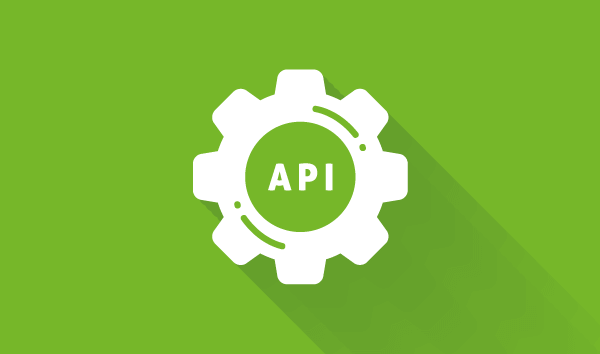

<h1 align="center">
    <a href="https://www.algaworks.com/" target="_blank">
      
    </a>
</h1>

<h4 align="center">
  🚀 Especialista Spring REST - AlgaFood
</h4>

<p align="center">
  

  

  <a href="https://github.com/wilsonjuniordev/algaworks-algafood/commits/master">
    
  </a>

  <a href="https://github.com/wilsonjuniordev/algaworks-algafood/issues">
    
  </a>

  
</p>

<p align="center">
  <a href="#-projeto">Projeto</a>&nbsp;&nbsp;&nbsp;|&nbsp;&nbsp;&nbsp;
  <!-- <a href="#-layout">Layout</a>&nbsp;&nbsp;&nbsp;|&nbsp;&nbsp;&nbsp; -->
  <a href="#rocket-tecnologias">Tecnologias</a>&nbsp;&nbsp;&nbsp;|&nbsp;&nbsp;&nbsp;
  <a href="#rocket-executando">Executando</a>&nbsp;&nbsp;&nbsp;|&nbsp;&nbsp;&nbsp;
  <a href="#memo-licença">Licença</a>
</p>
<br>

## 💻 Projeto

Esse projeto foi desenvolvido durante o treinamento Especialista Spring REST da AlgaWorks. Trata-se de um projeto imersivo focado em back-end, do básico ao ultra avançado sobre REST APIs com Spring.

<!-- ## 🎨 Layout

Você pode encontrar o layout nesse link: -->

## :rocket: Tecnologias

Esse projeto foi desenvolvido com as seguintes tecnologias:

- [Java](https://docs.oracle.com/en/java/)
- [Spring](https://spring.io/)

## :notebook: Executando

### Backend

```bash
# Clone este repositório
$ git clone https://github.com/wilsonjuniordev/algaworks-algafood.git

# Acesse a pasta do projeto no seu terminal/cmd
$ cd algafood
```

---

Feito com horas em frente ao :computer: por [Wilson Junior](http://wilsonjunior.net/)
